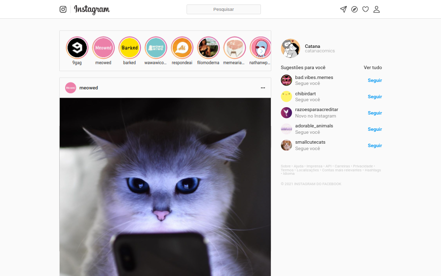
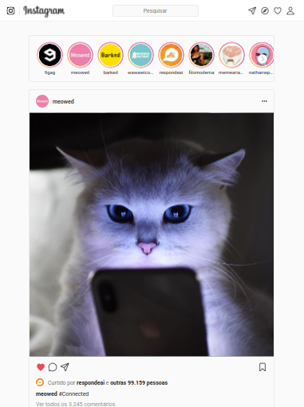
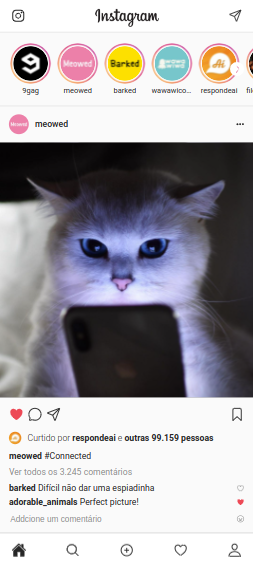
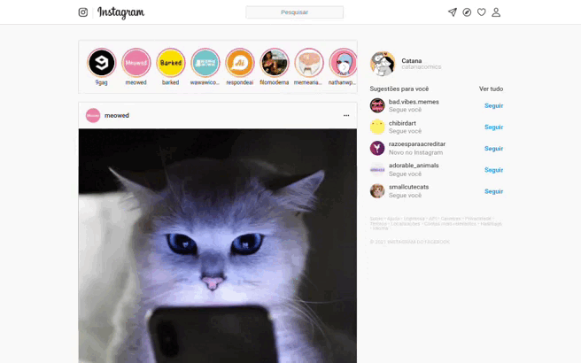

<p align="center">
    
</p>

# <p align="center">Instagram 2.0</p>

#### <p align = "center">Inspiração da rede social Instagram</p>

<p align = "center" >

   

   

   

   

   
</p>

$~$

### :clipboard: Descrição

Este projeto é um clone da rede social [Instagram](https://www.instagram.com). Foi desenvolvido a partir dos arquivos base disponibilizados (instagram.zip), construiu-se todo o layout, utilizando o React.

Neste projeto, é possível visualizar os posts disponíveis no feed do usuário, curtindo posts e seus comentários, com uma interface semelhante à do site original.

#### #️⃣ [Acesse aqui](https://instagram2-0-lovat.vercel.app)

---

### :rocket: Rodando localmente

Este projeto foi iniciado com [Create React App](https://github.com/facebook/create-react-app), portanto, certifique-se de ter a última versão estável do [Node.js](https://nodejs.org/en/download) e [npm](https://www.npmjs.com/) rodando localmente.

Primeiro de tudo, clone este projeto ou faça o download do ZIP.

Para realizar o clone, no terminal de sua máquina, insira o seguinte comando:

```bash
    git clone git@github.com:GabrielaTiago/Instagram2.0.git
```

Entre na pasta do projeto

```bash
    cd Instagram2.0
```

Execute o seguinte comando para instalar as dependências.

```bash
    npm install
```

Depois de instalar as dependências, execute o comando para iniciar a aplicação.

```bash
    npm run start
```

A aplicação será iniciada em "http://localhost:3000" no seu navegador.

---

### :computer: Telas

##### Desktop:



##### Tablet:



##### Mobile:



---

### 🎮 Usando



---

### :books: Lições Aprendidas

- React
- JSX
- Componentização
- React Fragment
- Import e Exports
- onClick
- useState
- Ciclo de vida
- Virtual DOM
- Custom Hooks

---

### :bulb: Reconhecimentos

- [Badges para Github](https://github.com/alexandresanlim/Badges4-README.md-Profile#-database-)
- [README Inspiração de README](https://gist.github.com/luanalessa/7f98467a5ed62d00dcbde67d4556a1e4#file-readme-md)
- [Driven Education](https://www.driven.com.br)

---

### 👩‍🦱 Autora

- Gabriela Tiago é uma aluna de desenvolvimento web de Fullstack na Driven Education. Percorrendo o caminho do conhecimento, buscando aprimorar suas habilidades técnicas e de softskills, para que ela possa melhorar o trabalho que desenvolve.

<br>[🔝 De volta ao topo](#instagram-20)<br>
